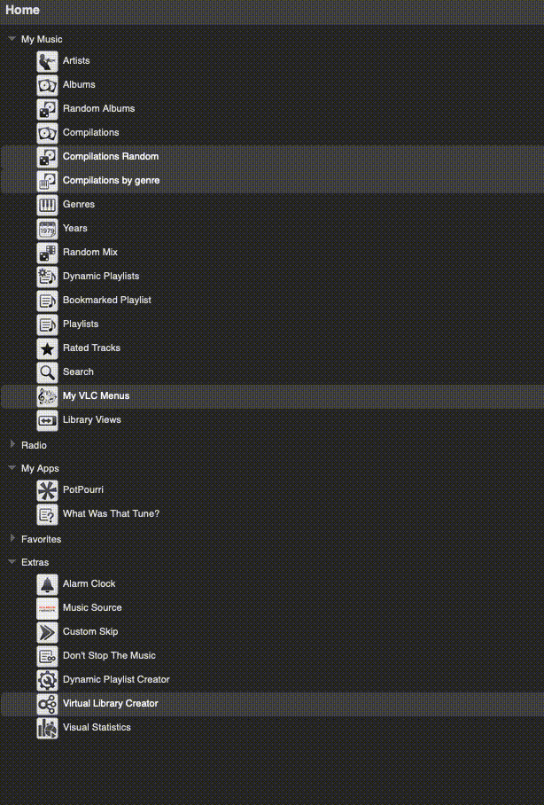

Virtual Library Creator
====

A plugin for [Logitech Media Server](https://github.com/Logitech/slimserver) 

**Create custom virtual libraries** with optional LMS **browse menus** using a template **in a browser** or by *adding files* with customized SQLite statements.

  
[⬅️ **Back to the list of all plugins**](https://github.com/AF-1/)
  

## Requirements

- LMS version >= 7.**9**
- LMS database = **SQLite**
   

## Features:
- **Create custom virtual libraries** using a template *in a browser* **or** by *adding your own sql files* with customized SQLite statements.
- **Create** optional **LMS browse menus** for your virtual libraries.
- Have some or all of your virtual libraries **automatically refreshed daily** at a set time.
- Enable/disable *individual* virtual libraries.
- *Temporarily pause/disable **all** virtual libraries* (e.g. for troubleshooting).
   

## Screenshots

   

## Installation
⚠️ **Please read the [FAQ](https://github.com/AF-1/lms-virtuallibrarycreator#faq) *before* installing this plugin.** 

### Using the repository URL

- Add the repository URL below at the bottom of *LMS* > *Settings* > *Plugins* and click *Apply*:
[https://raw.githubusercontent.com/AF-1/lms-virtuallibrarycreator/main/public.xml](https://raw.githubusercontent.com/AF-1/lms-virtuallibrarycreator/main/public.xml)

- Install the new version.

💡 When VLC is available from the LMS main repository, you can delete this URL from *LMS* > *Settings* > *Plugins*.
  

### Manual Install

Please read the instructions on how to [install a plugin manually](https://github.com/AF-1/sobras/wiki/Manual-installation-of-LMS-plugins).
    

## Reporting a new issue

If you want to report a new issue, please fill out this [**issue report template**](https://github.com/AF-1/lms-virtuallibrarycreator/issues/new?template=bug_report.md&title=%5BISSUE%5D+).
    

## FAQ

»<b>How do I <i>create</i> custom virtual libraries?</b>«
 

- Go to <i>LMS Home menu</i> > <i>Extras</i> > <i>Virtual Library Creator</i> > <i>Create new virtual library</i>. 

- Enter a <b>name</b> (required), set the <b>parameters</b> you want to use and then <b>save</b> it. That's it.  

After a couple of seconds, LMS will start creating your virtual library (and any browse menus you've enabled). Depending on the size of your virtual library, this may take a while. 

💡 You don't have to use browse menus. You can just create virtual libraries / library views without browse menus.

**Users familiar with SQLite** can add an **sql** file to the <i>VirtualLibraryCreator</i> folder with a customized SQLite statement. 
You can add browse menus and some options to a virtual library based on a *customized* SQLite statement in VLC but you **cannot edit your SQLite statement in the VLC plugin itself**.  
💡 Virtual libraries and their optional browse menus are only created if you've enabled them, i.e. checked the <i>Enabled</i> box.

 

»<b>Can I <i>import</i> my <i>custom SQLite statements</i> from the deprecated<i>SQLite Virtual Libraries</i> plugin?</b>«
 

Yes. Just drop the <b>sql</b> file(s) into the <i>VirtualLibraryCreator</i> folder (default location in the LMS playlists folder, can be changed in the plugin settings). 
If you recreate them using the UI template, you can edit them more easily later.

 

»<b>How do I <i>edit</i> custom virtual libraries I've created with this plugin?</b>«
 

<i>Virtual Library Creator</i> displays a list of all virtual libraries that you have created with this plugin. If you want to change the name of your virtual library or some parameters, click on the <b>Edit</b> button next to the playlist's name, make your changes and save it. After a couple of seconds, LMS will start recreating your virtual library and pick up the changes.

 

»<b>Can I <i>edit the SQLite statement</i> of my virtual library manually in VLC?</b>«
 

The target group for this plugin is users who want to quickly and easily create custom virtual libraries using <b>only</b> a <b>web browser template</b> and <b>not</b> working directly with SQLite statements. Accordingly, VLC does <b>not include the option to edit SQLite statements</b> manually in a tiny text area.

 

»<b>LMS is unresponsive for a short time after I've saved a new/edited virtual library or after a reboot/rescan. Why?</b>«
 

The time LMS takes to <b>boot</b> or to <b>recreate virtual libraries</b> increases with the number of virtual libraries enabled. So if you have a rather large library and many virtual libraries with a lot of tracks, it'll take LMS some time to recreate them. During that time LMS may be rather sluggish or unresponsive. That's normal. You can set the <i>debug level</i> for this plugin on the <i>LMS settings</i> > <i>Logging</i> page to <b>Info</b> to get more precise time information. 

When you've <i>saved</i> a <i>new or edited</i> virtual library, the plugin will wait about 3 seconds before telling LMS to (re)create new and edited virtual libraries. Same as above: LMS may be rather sluggish or unresponsive during that time and you won't see any browse menus before this process is completed.

 

»<b>What do the <i>icons in the virtual library list</i> mean?</b>«
 

 : This virtual library <b>has browse menus</b>.  
 : This virtual library is <b>scheduled for a daily refresh</b>.  
 : This virtual library is <b>enabled</b>.  
 : This virtual library is <b>disabled</b>.  
 : This virtual library like all other VLC virtual libraries has been <b>temporarily paused</b>/disabled.  
<i>Temporarily (un)pausing</i> all VLC virtual libraries does <b>not</b> change the enabled/disable parameter of <b>individual</b> virtual libraries.

 

»<b>What's a <i>daily refresh</i>?</b>«
 

Normally, LMS recreates virtual libraries only after a rescan or reboot which updates the list of tracks matching the search parameters of your virtual libraries.  
However, if you rate, play or skip tracks between rescans/reboots, virtual libraries with parameters like <i>rating</i>, <i>playCount</i>, <i>date lastPlayed</i>, <i>skipCount</i>, <i>date lastSkipped</i> or <i>dynamic played skipped value</i> may not contain all matching tracks. 
In these cases, you can use the <b>daily refresh</b> option. Once a day at a time that you can set in the settings, VLC will refresh/rebuild all VLC virtual libraries with this option enabled, i.e. update the list of matching tracks. If your server is in sleep mode or switched off at this time, the refresh will happen as soon as the server wakes up or is switched on again.

 

»<b>What effect does the <i>Home menu position</i> parameter have?</b>«
 

To reduce clutter all browse menus are collected (as sub-menus) in the VLC menu folder by default. You can change name and icon of this folder in the plugin settings. 

If you want your menu(s) to be displayed in the LMS <b>Home</b> menu (top level menu), check the <i>Display in Home menu</i> box. They will be appended to the end of the LMS Home menu unless you set a value for <i>Home menu position</i>. 

The <i>Home menu position</i> field expects a number that determines the position in the home menu. The higher the number, the further down the LMS Home menu your browse menus are placed. 
<b>Collected</b> browse menus (in the VLC folder) are <b>sorted alphabetically</b>. Home menu position values have no effect there.

 

»<b>I <i>can't save</i> new virtual libraries. I get this error message: “Could not access the <i>VirtualLibraryCreator</i> folder“.</i></b>«
 

The <i>VirtualLibraryCreator</i> folder is where VLC stores all files related to your custom virtual libraries. The folder name is hard-coded and must not be changed. 
On every LMS (re)start, VLC checks if there's a folder called <i>VirtualLibraryCreator</i> in the parent folder. The default <b>parent</b> folder is the <i>LMS playlist folder</i> but you can change that in VLC's preferences. If it doesn't find the folder <i>VirtualLibraryCreator</i> inside the specified parent folder, it will try to create it.  
The most likely cause for the error message above and matching error messages in the server log is that VLC can't create the folder because LMS doesn't have read/write permissions for the parent folder (or the <i>VirtualLibraryCreator</i> folder).  
So please make sure that <b>LMS has read/write permissions (755) for the parent folder - and the <i>VirtualLibraryCreator</i> folder</b> (if it exists but cannot be accessed).

 

»<b>What are the files in the <i>VirtualLibraryCreator</i> folder for? Can I edit them?</b>«
 

When you <i>save</i> a new or edited custom virtual library, VLC will create 2 files in the <i>VirtualLibraryCreator</i> folder (default location in the LMS playlists folder, can be changed in the plugin settings): 

- the file with the <b>customvalues.xml</b> extension contains the parameter values you selected for this virtual library. It allows you to easily <i>edit</i> your custom virtual library in VLC at a later time. 

- In addition, VLC will <b>always</b> save your custom virtual library as an SQLite statement (file extension: <b>sql</b>) which is used to make LMS create your virtual libraries. 

<b>⚠️ Please do <u><i>not</i></u> move or edit any of these files yourself.</b> VLC will overwrite the changes. Or worse, your custom virtual library will no longer work. And please <b>do not rename the <i>VirtualLibraryCreator</i> folder</b>.

 **Exception**: editing the customized SQLite statement of *sql* files that you have **added manually** and that have no corresponding *customvalues.xml* file.</b>

 

»<b>Sometimes browse menus contain <i>incorrect and empty</i> items.</b>«
 

Under certain circumstances you may see (empty) albums, artists, genres or years in some VLC browse menus that shouldn't be there. Your virtual library does not contain incorrect tracks. This issue is linked to the way LMS creates these browse menus. There's nothing I can do about it at the moment. If possible, just go down one level: click to <i>show all tracks</i> or <i>show all albums</i>. 
In case this LMS issue ever gets resolved, I'll update this page.

 

»<b>What's the <i>difference</i> between <i>recreating<i> and <i>refreshing</i> virtual libraries?</b>«
 

<b>Refreshing</b> (or rebuilding) a virtual library means that LMS will <b>update the list of tracks matching the virtual library's search parameters</b> (see <i>daily refresh</i> FAQ).  
<b>Recreating</b> a virtual library means unregistering the virtual library and then recreating it. This happens, for example, when you <b><i>save</i> an <i>edited</i> virtual library</b>. If you've <b>edit</b>ed only a single parameter, you'll have to pass the <b>new search parameters</b> to LMS so it can get the <b>correct matching tracks</b>. Refreshing instead of recreating would ask LMS to use the old search parameters. So recreating and refreshing a virtual library will both update the list of matching virtual library tracks but recreating is required if the search parameters have changed.  
If your virtual library is disabled or virtual libraries are globally paused/disabled, editing virtual libraries will not trigger anything. The changes will take effect the next time you enable a currently disabled virtual library or when you unpause all temporarily disabled virtual libraries. 
VLC handles all of this automatically. Even though it should never be necessary, you can always force LMS to recreate all VLC virtual libraries by pausing & unpausing them or with the <b>Recreate now</b> button in the plugin settings.

 

»<b>I've enabled the <i>Albums without compilations</i> menu for the LMS <i>Home</i> menu. Where is it?</b>«
 

I couldn't get the <i>Albums without compilations</i> to work reliably in the LMS <b>Home</b> menu. Therefore, it's disabled. It works in the collected menus folder though.

 

»<b>Can you translate VLC into my language?</b>«
 

This plugin will never be fully localized because the parameter and value names in the template are hard-coded. If you want to localize the rest (e.g. for browse menu suffixes etc.), please read <a href="https://github.com/AF-1/sobras/wiki/Adding-localization-to-LMS-plugins"><b>this</b></a>.

 

   
