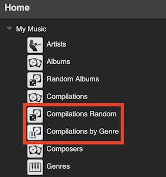

Virtual Library Creator
====
%3D'plugin'%20and%20%40name%3D'VirtualLibraryCreator'%5D%2F%40minTarget&prefix=v&label=Min.%20LMS%20Version%20Required&color=darkgreen) 

**Create custom virtual libraries** / library views with optional LMS **browse menus** using a template **in a browser** or by *adding files* with customized SQLite statements.
  

> [!TIP]
> The template allows you to create virtual libraries for many purposes, but of course it can not cover all conceivable use cases. 
> Don't forget: with this plugin you can also use customized (raw) SQLite statements tailored exactly to your needs (see [FAQ](#faq)).

  
[⬅️ **Back to the list of all plugins**](https://github.com/AF-1/)
  
**Use the** &nbsp;  &nbsp;**icon** (top right) to **jump directly to a specific section.**

  

## Screenshots[^1]

   

## Features

* **Create custom virtual libraries** with ease *in your browser* choosing from a comprehensive list of selection criteria / options.

* If you have a very specific / corner use case, you can also *add your own sql files* with customized SQLite statements. VLC will pick them up.

* **Editing** existing virtual libraries created with VLC **later** on is easy.

* Have some or all virtual libraries **refreshed automatically every day** at a specific time or force a manual update.

* Enable / **disable** *individual* virtual libraries.

* *Temporarily pause / disable **all** virtual libraries* (e.g. for troubleshooting).

* **Create** optional(!) **LMS browse menus** for your virtual libraries.

* Use custom tags imported with the [**Custom Tag Importer**](https://github.com/AF-1/lms-customtagimporter) plugin

   

## Installation

*Virtual Library Creator* is available from the LMS plugin library: `LMS > Settings > Manage Plugins`. 

If you want to test a new patch that hasn't made it into a release version yet, you'll have to [install the plugin manually](https://github.com/AF-1/sobras/wiki/Manual-installation-of-LMS-plugins).
    

## Report a new issue

To report a new issue please file a GitHub [**issue report**](https://github.com/AF-1/lms-virtuallibrarycreator/issues/new/choose).
   

## ⭐ Help others discover this project

If you find this project useful, giving it a  (top right of this page) is a great way to show your support and help others discover it. Thank you.
    

## FAQ

»<b>How do I <i>create</i> custom virtual libraries?</b>«
 

- using the `VLC template`:
    - Go to <i>LMS Home menu</i> > <i>Extras</i> > <i>Virtual Library Creator</i> > <i>Create new virtual library</i>. 

    - Enter a <b>name</b> (required), set the <b>parameters</b> you want to use and then <b>save</b> it. That's it.  

    After a couple of seconds, LMS will start creating your virtual library (and any browse menus you've enabled). Depending on the size of your virtual library, this may take a while. 

    > 💡 You don't have to use browse menus. You can just create virtual libraries / library views without browse menus.

 

- adding `manually customized SQLite statements`:  
    **Users familiar with SQLite** can add an **sql** file to the <i>VirtualLibraryCreator</i> folder with a customized SQLite statement. 
You can add browse menus and some options to a virtual library based on a *customized* SQLite statement in VLC but you ***cannot edit* your SQLite statement in the VLC plugin itself**.  

> 💡 Virtual libraries and their optional browse menus are only created if you've enabled them, i.e. checked the <i>Enabled</i> box.

 

»<b>How do I <i>edit</i> custom virtual libraries I've created with this plugin?</b>«
 

<i>Virtual Library Creator</i> displays a list of all virtual libraries that you have created with this plugin. If you want to change the name of your virtual library or some parameters, click on the `Edit` button next to the virtual library's name, make your changes and save it. After a couple of seconds, LMS will start recreating your virtual library and pick up the changes.

 

»<b>What do the <i>icons in the virtual library list</i> mean?</b>«
 

 : This virtual library <b>has browse menus</b>.  
 : This virtual library is <b>scheduled for a daily refresh</b>.  
 : This virtual library is <b>enabled</b>.  
 : This virtual library is <b>disabled</b>.  
 : This virtual library like all other VLC virtual libraries has been <b>temporarily paused</b>/disabled.  
<i>Temporarily (un)pausing</i> all VLC virtual libraries does <b>not</b> change the enabled/disable parameter of <b>individual</b> virtual libraries.

 

»<b>Can I <i>edit the SQLite statement</i> of my virtual library manually in VLC?</b>«
 

The target group for this plugin is users who want to quickly and easily create custom virtual libraries using <b>only</b> a <b>web browser template</b> and do <b>not</b> want to work with raw SQLite statements. Accordingly, VLC does <b>not include the option to edit SQLite statements</b> manually in a tiny text area.

 

»<b>LMS is unresponsive for a short time after I've saved a new/edited virtual library or after a reboot/rescan. Why?</b>«
 

The time LMS takes to <b>boot</b> or to <b>recreate virtual libraries</b> increases with the number of virtual libraries enabled and the library size. So if you have a rather large library and many virtual libraries with a lot of tracks, it'll take LMS some time to recreate them. During that time LMS may be rather sluggish or unresponsive. That's normal. You can set the <i>debug level</i> for this plugin on the <i>LMS settings</i> > <i>Logging</i> page to <b>Info</b> to get more precise time information. 

When you've <i>saved</i> a <i>new or edited</i> virtual library, the plugin will wait about 3 seconds before telling LMS to (re)create new and edited virtual libraries. Same as above: LMS may be rather sluggish or unresponsive during that time and you won't see any browse menus before this process is completed.

 

»<b>What's a <i>daily refresh</i>?</b>«
 

Normally, LMS recreates virtual libraries only after a rescan or reboot which updates the list of tracks matching the search parameters of your virtual libraries.  
However, if you rate, play or skip tracks between rescans/reboots, virtual libraries with parameters like <i>rating</i>, <i>playCount</i>, <i>date lastPlayed</i>, <i>skipCount</i>, <i>date lastSkipped</i> or <i>dynamic played skipped value</i> may not contain all matching tracks. 
In these cases, you can use the <b>daily refresh</b> option. Once a day at a time that you can set in the settings, VLC will refresh/rebuild all VLC virtual libraries with this option enabled, i.e. update the list of matching tracks. If your server is in sleep mode or switched off at this time, the refresh will happen as soon as the server wakes up or is switched on again.

 

»<b>What effect does the <i>Home menu position</i> parameter have?</b>«
 

To reduce clutter all browse menus are collected (as sub-menus) in the VLC menu folder by default. You can change name and icon of this folder in the plugin settings. 

If you want your menu(s) to be displayed in the LMS <b>Home</b> menu (top level menu), check the <i>Display in Home menu</i> box. They will be appended to the end of the LMS Home menu unless you set a value for <i>Home menu position</i>. 

The <i>Home menu position</i> field expects a number that determines the position in the home menu. The higher the number, the further down the LMS Home menu your browse menus are placed. 
<b>Collected</b> browse menus (in the VLC folder) are <b>sorted alphabetically</b> by virtual library id. Home menu position values have no effect there.

 

»<b>I've changed the name of a virtual library but its browse menus in the VLC browse folder are not sorted in the correct alphabetical order. Why?</b>«
 

<b>Collected</b> browse menus (in the VLC folder) are <b>sorted alphabetically</b> by virtual library <b>id</b>, <i>not</i> virtual library <b>name</b>. VLC uses the virtual library id for multipe purposes. It contains the library name you <b>first</b>(!) gave your library and does <b>not</b> change, even if you rename your library later on. 
So if you absolutely need to change the sort order of your library's browse menus in the VLC browse menu folder, you'd have to delete the VLC library and recreate it with the correct name.

 

»<b>What are the files in the <i>VirtualLibraryCreator</i> folder for? Can I edit them?</b>«
 

When you <i>save</i> a new or edited custom virtual library, VLC will create 2 files in the <i>VirtualLibraryCreator</i> folder (default location in the LMS preferences folder, can be changed in the plugin settings): 

- the file with the <b>customvalues.xml</b> extension contains the parameter values you selected for this virtual library. It allows you to easily <i>edit</i> your custom virtual library in VLC at a later time. 

- In addition, VLC will <b>always</b> save your custom virtual library as an SQLite statement (file extension: <b>sql</b>) which is used to make LMS create your virtual libraries. 

<b>🚫⚠️ Please do <u><i>not</i></u> rename, move or edit any of these files yourself.</b> VLC will overwrite the changes. Or worse, your custom virtual library or selected library view will no longer work. And please <b>do not rename the <i>VirtualLibraryCreator</i> folder</b>.

 **Exception**: editing the customized SQLite statement of *sql* files that you have **added manually** and that have no corresponding *customvalues.xml* file.</b>

 

»<b>Sometimes browse menus contain <i>incorrect and empty</i> items.</b>«
 

Under certain circumstances you may see (empty) albums, artists, genres or years in some VLC browse menus that shouldn't be there. Your virtual library does not contain incorrect tracks. This issue is linked to the way LMS creates these browse menus. There's nothing I can do about it at the moment. If possible, just go down one level: click to <i>show all tracks</i> or <i>show all albums</i>. 
In case this LMS issue ever gets resolved, I'll update this page.

 

»<b>What's the <i>difference</i> between <i>recreating</i> and <i>refreshing</i> virtual libraries?</b>«
 

<b>Refreshing</b> (or rebuilding) a virtual library means that LMS will <b>update the list of tracks matching the virtual library's search parameters</b> (see <i>daily refresh</i> FAQ).  
<b>Recreating</b> a virtual library means unregistering the virtual library and then recreating it. This happens, for example, when you <b><i>save</i> an <i>edited</i> virtual library</b>. If you've <b>edit</b>ed only a single parameter, you'll have to pass the <b>new search parameters</b> to LMS so it can get the <b>correct matching tracks</b>. Refreshing instead of recreating would ask LMS to use the old search parameters. So recreating and refreshing a virtual library will both update the list of matching virtual library tracks but recreating is required if the search parameters have changed.  
If your virtual library is disabled or virtual libraries are globally paused/disabled, editing virtual libraries will not trigger anything. The changes will take effect the next time you enable a currently disabled virtual library or when you unpause all temporarily disabled virtual libraries. 
VLC handles all of this automatically. Even though it should never be necessary, you can always force LMS to recreate all VLC virtual libraries by pausing & unpausing them or with the <b>Manual Refresh</b> button.

 

»<b>How do I use custom tags from the <i>Custom Tag Importer</i> plugin?</b>«
 

You can use up to 8 custom tags from the <i>Custom Tag Importer</i> database table. If you use different logical operators (and/or) to link them, please make sure that you <b>group the custom tags</b> <i>linked by AND</i> and <i>those linked by OR</i>.  <i>Example:</i> if you have 5 custom tags (A, B, C, D, E) and you definitely want 2 of them (A, B) and one of the remaining 3 (C, D, E), put them in this order: A <b>and</b> B <b>and</b> ( C <b>or</b> D <b>or</b> E ). The 2 ANDs first, then the ORs. Both groups are linked by AND.

 

»<b>I've enabled the <i>Albums without compilations</i> menu for the LMS <i>Home</i> menu. Where is it?</b>«
 

I couldn't get the <i>Albums without compilations</i> to work reliably in the LMS <b>Home</b> menu. Therefore, it's disabled. It works in the collected menus folder though.

 

»<b>I <i>can't save</i> new virtual libraries. I get this error message: “Could not create the <i>VirtualLibraryCreator</i> folder“.</i></b>«
 

The <i>VirtualLibraryCreator</i> folder is where VLC stores all files related to your custom virtual libraries. The folder name is hard-coded and must not be changed. 
On every LMS (re)start, VLC checks if there's a folder called <i>VirtualLibraryCreator</i> in the parent folder. The default <b>parent</b> folder is the <i>LMS preferences folder</i> but you can change that in VLC's preferences. If it doesn't find the folder <i>VirtualLibraryCreator</i> inside the specified parent folder, it will try to create it.  
The most likely cause for the error message above and matching error messages in the server log is that VLC can't create the folder because LMS doesn't have read/write permissions for the parent folder (or the <i>VirtualLibraryCreator</i> folder).  
So please make sure that <b>LMS has read/write permissions (755) for the parent folder - and the <i>VirtualLibraryCreator</i> folder</b> (if it exists but cannot be accessed).

 

»<b>Clicking the <i>Manual Refresh</i> button resets the active library view to the <i>complete library</i>.</b>«
 

The <i>Manual Refresh</i> button forces the plugin to manually recreate all enabled virtual libraries (incl. menus). If you have selected a <i>VLC</i> library as the <i>active</i> library view for a client, LMS will reset the client library view to the <i>complete library</i> because recreating your VLC virtual library makes it temporarily unavailable.

 

»<b>I want to create <i>home</i> menus for <i>random compilations</i> and <i>compilations by genre</i> based on my complete library. But the names are duplicated and the home menu positions are wrong. How do I get the correct names and positions like in the screenshot?</b>«
 

  
It's in the name. If you create two new virtual libraries and name them <i>Compilations Random</i> and <i>Compilations by genre</i>, you get the menus (names + positions) from the screenshot.  
<b>Example</b> - how to create the random compilations menu (complete library): 

- create a new virtual library - name: <i>Compilations Random</i> 
- check <i>Only include tracks from compilation albums</i> 
- in the <i>Album menus</i> section: check <i>Random compilations</i> 
- check <i>Display directly in Home menu (ungrouped)</i> 

 
Normally the name of the menu would be <i>Compilations Random - Random Compilations</i>. The first part would be the name of your virtual library, the second part the name of the browse menu. However, if your library is named <i>Compilations Random</i>, VLC assumes that you want to create a browse menu in the home menu for random compilations of your complete library. It will drop the browse menu name (to avoid duplication) and place the menu directly below the default LMS Compilations menu. 
This also applies to virtual libraries named <i>Compilations by genre</i> or <i>Composers</i>.

 

»<b>Can this plugin be <i>displayed in my language</i>?</b>«
 

This plugin will not be localized because the parameter and value names in the templates are hard-coded. And a halfway localized version is worse than a non-localized one.

 

   

[^1]: The screenshots might not correspond to the UI of the latest release in every detail.
